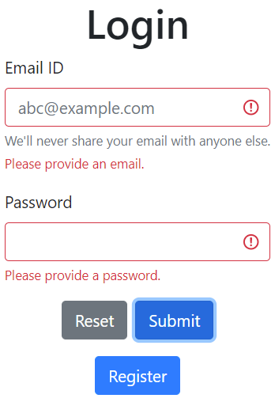

#About:
======
Web application for showing Bitcoin price in Ukrainian Hryvnas

To start the app:
=================
Type in console:
npm init
node app.js

Navigate to:
http://localhost:3000/

Language: JavaScript (Node.js + Express)
Security: bcrypt (encrypt passwords)

Modules:
========
npm install express bcrypt body-parser cookie-parser --save

Endpoints:
==========
- /
- /user/login;
- /user/logout;
- /user/create;
- /btcRate.

User can:
=========
- register;
- login;
- see Bitcoint price in USD and UAH (Ukrainian currency);
- logout.

Misc.
=====
- user credentials are stored in userDB.json file;
- passwords are encrypted with bcrypt;
- user authorization is managed via cookies;
- basic form validation present.

