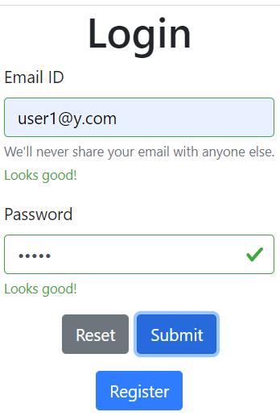

About:
======
Web application in JavaScript (Node.js) demonstrating basic login and user authorization using cookies. 
Shows Bitcoin price for logged in users.

To start the app:
=================
Type in console: 
npm init 
node app.js 

Navigate to:
http://localhost:3000/

Modules:
========
- express;
- bcrypt;
- body-parser;
- cookie-parser.

To install modules: 
npm install express bcrypt body-parser cookie-parser --save

Endpoints:
==========
- /
- /user/login;
- /user/logout;
- /user/create;
- /btcRate.

User can:
=========
- register;
- login;
- see Bitcoint price in USD and UAH (Ukrainian currency);
- logout.

Misc.
=====
- user credentials are stored in userDB.json file;
- passwords are encrypted with bcrypt;
- user authorization is managed via cookies;
- basic form validation present.

 
 
 
 
 
 
